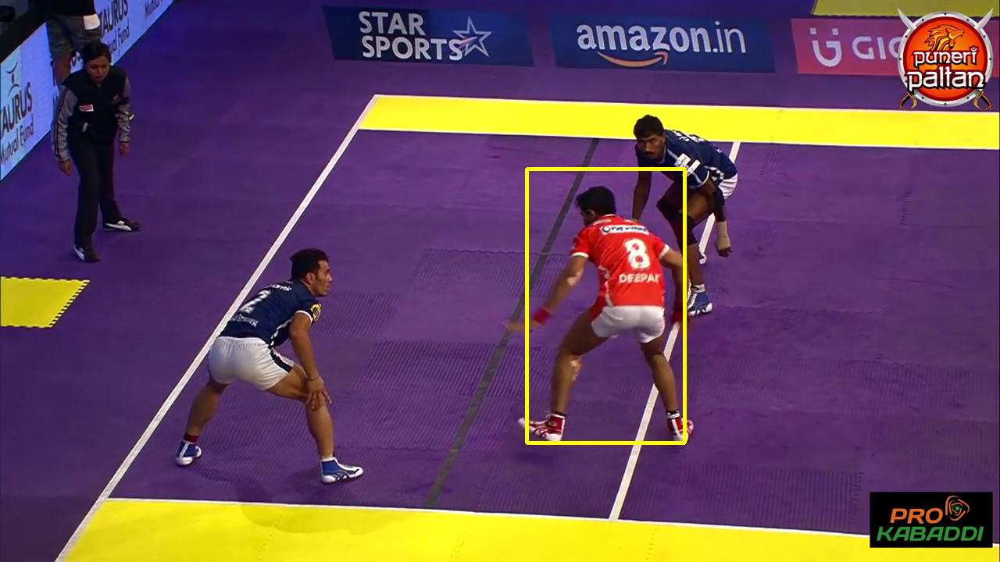
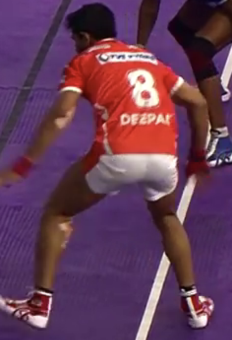

# TrackJectory
## Tracking and Trajectory Prediction 

Components Implemented :-
1. Siamese Tracker for online visual tracking.
2. FairMOT for multi-object detection and tracking. (<a href="https://medium.com/analytics-vidhya/fairmot-multi-object-tracking-386afe930b24">FairMOT: Multi-Object Tracking</a>)
3. Social GCN for trajectory forcasting.
 
[1] is implemented to identify and track the template image provided as input across the video frames. Its a single object tracking mechanism. 
[2] is a single shot MOT tracker used to predict multiple objects across frames while tracking them simultaneously. After extracting the tracked objects, those outputs are furnished to [3] to predict the trajectories.

The code is straightforward and easy to follow.

<ul>
<li><a href="https://github.com/Sai-Venky/Trackjectory#installation-and-running">Installation and Running</a></li>
<li><a href="https://github.com/Sai-Venky/Trackjectory#dataset">Dataset</a></li>
<li><a href="https://github.com/Sai-Venky/Trackjectory#directory-layout">Directory Layout</a></li>
<li><a href="https://github.com/Sai-Venky/Trackjectory#results">Results</a></li>
<li><a href="https://github.com/Sai-Venky/Trackjectory#acknowledgement">Acknowledgement</a></li>
<li><a href="https://github.com/Sai-Venky/Trackjectory#contributing">Contributing</a></li>
<li><a href="https://github.com/Sai-Venky/Trackjectory#licence">Licence</a></li>
</ul>

### Installation and Running

1. Run following to clone into local system `https://github.com/Sai-Venky/Trackjectory.git`.
1. Create conda environment `conda create --name track python=3.6` and activate it `conda activate track`.
2. Run `pip install -r requirements.txt`.
3. Run `pip install lap cython-bbox`
3. Setup DCNv2 by going into `cd DCNV2` and running `sh ./make.sh`.

### Dataset

The dataset is created from Kabaddi players videos curated from multiple platforms.
This was selected since this sport depicts a lot of movements (feints) and is challenging for forcasting trajectory correctly.

### Directory Layout

The directory structure is as follows :-

* **dataset :** contains the necessary files needed for loading the Siamese, MOT and Trajectory forcasting dataset along with transformation functions.
  * mot_dataset : training/validation and testing base class which instantiates the fairmot dataset and transforms the raw data with affine transformation.
  * siam_dataset : training/validation base class which instantiates the siamese dataset and returns the template with target frame.
  * trajectory_dataset : training/validation base class which instantiates the trajectory dataset with utlities for constructing graph based on sequences.
  * util : helper functions for preprocessing the image.
* **models :** this contains the base models for the 3 tasks with all of its constituent methods.
    * gcn : contains the social graph cnn model with time extrapolator cnn.
    * pose_dla_dcn : contains the dla-34 model with deformable convolutions initialization.
    * single_track : contains the siam rpn++ model (resnet) with depthwise correlation.
    * loss : contains the mot, bivariate and L1 loss functions.
* **utils :** this contains the utility methods needed.
    * config : contains the configuration options.
    * scheduler : contains the scheduler options for learning rate.
    * utils : contains the load, save model functions.
    * decode : contains the util functions for mot inference.
* **tracker :** this contains the tracker instantiations for performing live inference.
    * basetrack : the base class for mot tracking.
    * matching : contains the methods needed for fusing motion with iou, embedding and kalman filter outputs.
    * multitracker : implementation of JDE tracker for performing mot inference.
    * singletracker : implementation of SiamRPN++ tracker for performing sot inference.
* **tracking_utils :** this contains the utils needed for the mot tracker.
    * kalman_filter : contains the methods for predicting, updating KF values and computing gating distance between KF outputs and emedding distance.
    * log : logger function.
    * timer : timer function.
    * visualization : methods for visualizing the mot outputs.
* mot_track : main file performing tasks for tracking mot objects and creating the inputs for trajectory forcasting.
* mot_train : main file performing tasks for training fairMOT.
* sot_track : main file performing tasks for tracking sot objects.
* sot_train : main file performing tasks for training SiamRPN++.
* trajectory_test : main file performing tasks for testing Social GCN and visualization functions for forming the trajectories.
* trajectory_train : main file performing tasks for training Social GCN with outputs predicted from mot_track.

 ### Results
#### Multi Object Tracking

#### Trajectory Forcasting Output

#### Single Object Tracking Output and Template
&nbsp;&nbsp;

 ### Acknowledgement

https://github.com/ifzhang/FairMOT 
https://github.com/zllrunning/SiameseX.PyTorch 
https://github.com/abduallahmohamed/Social-STGCNN 

 ### Contributing

 You can contribute in serveral ways such as creating new features, improving documentation etc.

 ### Licence

 MIT Licence
